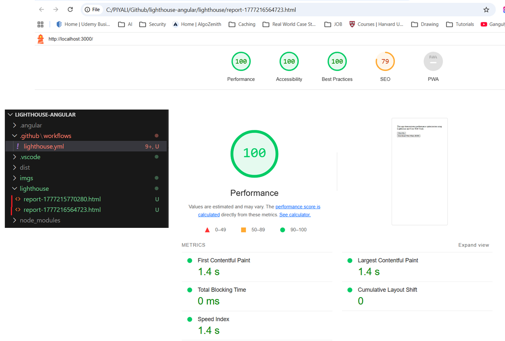
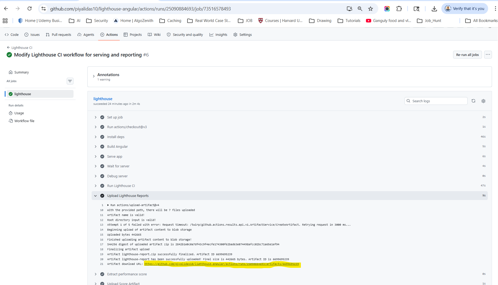
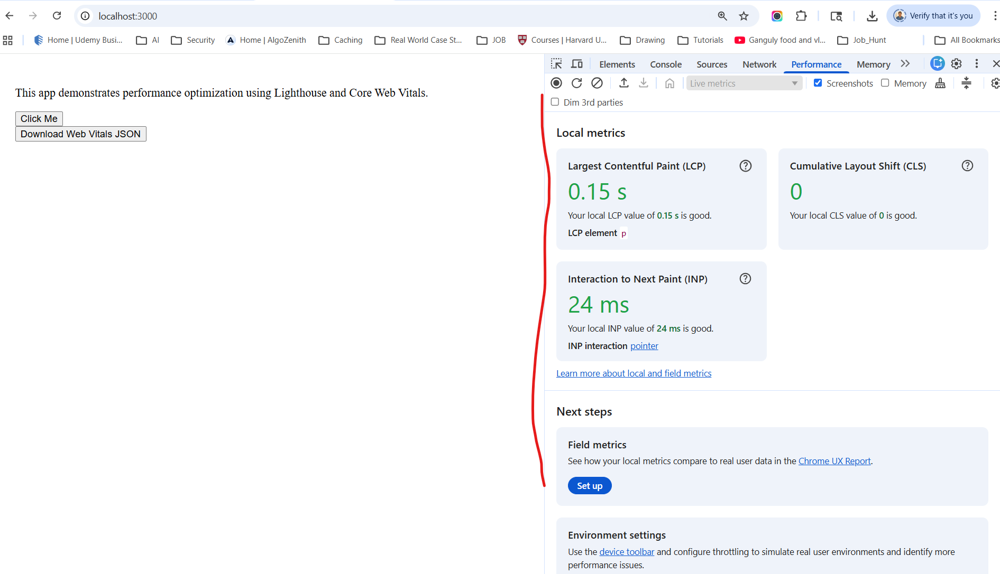
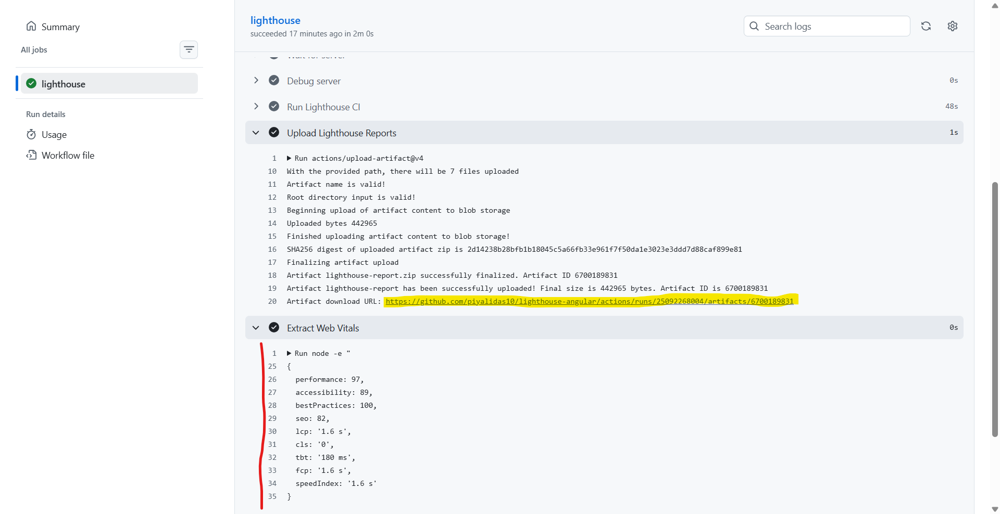
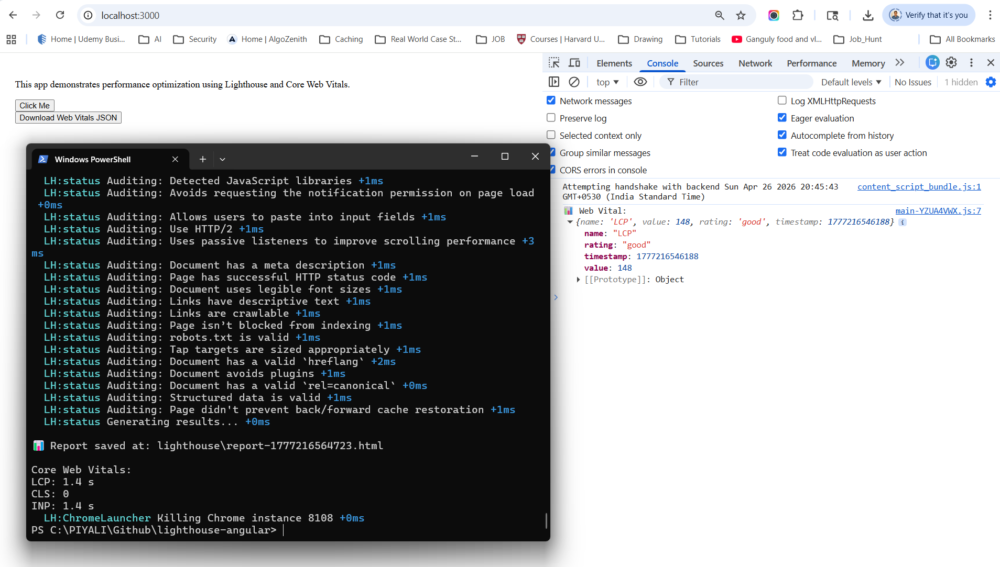
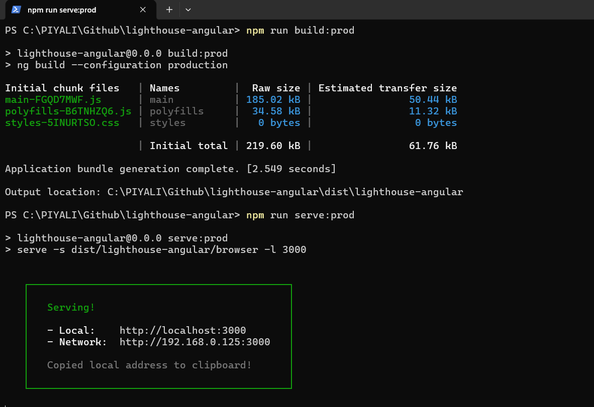

# lighthouse-angular
production-grade Angular + Google Lighthouse setup that you can actually use in a real project (and confidently explain in interviews)

+ Integrated Lighthouse CI into Angular project to automate performance audits and enforce Core Web Vitals thresholds (LCP, CLS), improving page load performance and preventing regressions via GitHub Actions.
+ Implemented end-to-end frontend performance monitoring system using Lighthouse CI with enforced Core Web Vitals thresholds, integrated into GitHub Actions to block regressions.
+ implemented Real User Monitoring (RUM) using web-vitals to track production performance.
+ serve is a lightweight static server with production build (for Lighthouse). use serve to host the Angular production build locally as a static server, ensuring Lighthouse audits run against a realistic HTTP environment instead of development mode.
    - run script : serve -s dist/angular-app -l 3000
    - Takes your built Angular files (dist/angular-app)
    - Starts a local web server
    - Serves them at: http://localhost:3000
    - Is serve a Backend Server? ❌ No — not like: Express.js, NestJS 👉 It’s only: Static file server (No APIs, No database)
    - You could also use: nginx (production) / http-server / Apache HTTP Server
+ Web Vitals metrics belong : LCP (Largest Contentful Paint), CLS (Cumulative Layout Shift), INP (Interaction to Next Paint)
    - 👉 These are shown under: ✅ Performance tab, not SEO
+ Lighthouse needs a real HTTP server. 
+ 🧭 Google Lighthouse splits audits into categories: Performance, Accessibility, Best Practices, SEO
+ 📁 lighthouse-report : Save inside /lighthouse folder**   
    📊 Report saved at: ./lighthouse/lighthouse-report.html 
    ```
    lighthouse-angular/
    ├── lighthouse/                 ✅ new folder
    │    ├── report-1714040000000.html
    |    ├── report-1714040500000.html
    |    ├── report-1714041000000.html
    ```
+ npm run serve:prod ("serve:prod": "serve -s dist/lighthouse-angular/browser -l 3000")
    ```
    dist/
    └── lighthouse-angular/
        ├── browser/   ✅ your real app
        ├── 3rdpartylicenses.txt
        └── prerendered-routes.json
    ```
    👉 Even if you didn’t enable SSR, newer Angular versions (17+) still generate a browser/ folder by default.
+ ❌ Why NOT just use npm start? This is development mode: 👉 Lighthouse on dev mode = fake / misleading scores
    - ng serve         → Developer experience (fast reload)
    - build + serve    → User experience (real performance)

+ ✅ Correct flow: 1) npm run build:prod 2) npm run serve:prod 3) npm run lighthouse

## Lighthouse Report
### Local


### Run Github Pipeline with raising the PR or commiting directly in main branch


## Web Vitals metrics
### Local


### Run Github Pipeline with raising the PR or commiting directly in main branch


## Run Application


🚀 🔹 1. Run Angular App (Normal Development)
-------------------------------------------------------------------
```
npm install
npm start
```

👉 Opens:
```
http://localhost:4200
```
⚠️ This is dev mode → DON’T use for Lighthouse

🚀 🔥 2. Run Production + Lighthouse (Local Testing)
-------------------------------------------------------------------
This is what you should use for performance testing with Google Lighthouse

**✅ Step 1: Build production**
```
npm run build:prod
```
```
ng build --configuration production
```
👉 This creates an optimized build: 
✅ Minified JS (smaller bundle) 
✅ Tree-shaking (unused code removed)   
✅ AOT compilation  
✅ Optimized CSS    
✅ Faster load time 

👉 Output:
```
dist/lighthouse-angular/browser/
```

**✅ Step 2: Serve production build**
```
npm run serve:prod
```
```
serve -s dist/lighthouse-angular/browser -l 3000
```
👉 This:
- Starts a real HTTP server
- Serves your optimized build
- Makes it accessible to tools like Google Lighthouse



👉 Runs on:
```
http://localhost:3000
```

**✅ Step 3: Run Lighthouse**

Open another terminal:
```
npm run lighthouse
```

**📊 Output**
- lighthouse-report.html
- lhci-reports/ folder
- Console metrics (LCP, CLS, INP)

🚀 ⚡ 3. Run Full Pipeline (One Command)
-------------------------------------------------------------------
If you added:
```
"perf": "npm run build:prod && npm run serve:prod & npm run lighthouse"
```
Then:
```
npm run perf
```
⚠️ On Windows → run in 2 terminals (recommended)

🚀 ☁️ 4. Lighthouse Run via GitHub Actions (CI)
-------------------------------------------------------------------
You DON’T run this manually.

Just:
```
git add .
git commit -m "test lighthouse"
git push
```

👉 What happens automatically:
-------------------------------------------------------------------
1. GitHub Actions triggers
2. Builds Angular app
3. Runs Lighthouse
4. Uploads reports
5. 💬 Comments scores on PR
6. 📈 Stores trend data

📍 Where to See Results
-------------------------------------------------------------------
**👉 Lighthouse Reports**
- GitHub → Actions tab
- Click run → download artifact lighthouse-report

**👉 PR Comment**
You’ll see:
```
🚀 Lighthouse Report
Performance: 92
Accessibility: 100
...
```

**👉 Trend Data**
- Artifact: lighthouse-score
- Contains:
```
{ "performance": 0.92 }
```

# 🧠 Quick Summary
| Mode       | Command                   | Use Case           |
| ---------- | ------------------------- | ------------------ |
| Dev        | `npm start`               | Development        |
| Prod       | `build:prod + serve:prod` | Real performance   |
| Lighthouse | `npm run lighthouse`      | Audit              |
| CI         | `git push`                | Automated pipeline |


## 📊 Typical Baseline
| Metric      | Value        | Status               |
| ----------- | ------------ | -------------------- |
| LCP         | ~2.5 – 3.5s  | ⚠️ Needs improvement |
| CLS         | ~0.1 – 0.25  | ❌ Poor               |
| INP         | ~200 – 400ms | ⚠️ Moderate          |
| Bundle Size | ~400–800 KB  | ⚠️ Heavy             |

## 🚀 Lighthouse CI with Thresholds (Fail Builds)

You already added Google Lighthouse — now enforce strict budgets.

✅ lighthouse-run.mjs → local testing    
✅ lighthouserc.json → CI + thresholds  

📄 lighthouserc.json (final version)
-----------------------------------------------------------
```
{
  "ci": {
    "collect": {
      "url": ["http://localhost:3000"],
      "numberOfRuns": 3
    },
    "assert": {
      "assertions": {
        "categories:performance": ["error", { "minScore": 0.9 }],
        "largest-contentful-paint": ["error", { "maxNumericValue": 2500 }],
        "cumulative-layout-shift": ["error", { "maxNumericValue": 0.1 }],
        "interactive": ["warn", { "maxNumericValue": 3000 }],
        "unused-javascript": ["warn", { "maxNumericValue": 200000 }]
      }
    },
    "upload": {
      "target": "filesystem",
      "outputDir": "./lhci-reports"
    }
  }
}
```

✅ If you are using:
- lhci autorun
- GitHub Actions (which you already set up)
- Performance thresholds (fail builds)
👉 Then lighthouserc.json is REQUIRED

👉 Now:
- Performance < 90 → ❌ build fails
- LCP > 2.5s → ❌ fail
- CLS > 0.1 → ❌ fail

📄 lighthouse-run.mjs
-----------------------------------------------------------
```
import lighthouse from 'lighthouse';
import * as chromeLauncher from 'chrome-launcher';
import fs from 'fs';

const chrome = await chromeLauncher.launch({
  chromeFlags: ['--headless', '--no-sandbox']
});

const options = {
  logLevel: 'info',
  output: 'html',
  port: chrome.port
};

const url = 'http://localhost:3000';

const runnerResult = await lighthouse(url, options);

// Save report
fs.writeFileSync('lighthouse-report.html', runnerResult.report);

const audits = runnerResult.lhr.audits;

console.log('\n📊 Core Web Vitals:');
console.log('LCP:', audits['largest-contentful-paint'].displayValue);
console.log('CLS:', audits['cumulative-layout-shift'].displayValue);
console.log('INP:', audits['interactive'].displayValue);

await chrome.kill();
```
❌ If you are using only:
- npm run lighthouse (your lighthouse-run.js)
- Manual testing

**📊 lighthouse-report : Save inside /lighthouse folder**  
```
lighthouse-angular/
 ├── lighthouse/                 ✅ new folder
 │    ├── report-1714040000000.html
 |    ├── report-1714040500000.html
 |    ├── report-1714041000000.html
 ├── lighthouse-run.mjs
 ├── package.json
 ├── src/
 ├── dist/
```

## 🔥GitHub Actions (Fail PRs Automatically + Store Reports in GitHub Artifacts)
📄 .github/workflows/lighthouse.yml

```
name: Lighthouse CI

on:
  pull_request:
  push:

jobs:
  lighthouse:
    runs-on: ubuntu-latest

    steps:
      - uses: actions/checkout@v3

      - name: Install deps
        run: npm install

      - name: Build Angular
        run: npm run build -- --configuration production

      - name: Serve app
        run: |
          npm install -g serve
          serve -s dist/lighthouse-angular -l 3000 &

      # ⏳ Wait for server (IMPORTANT)
      - name: Wait for server
        run: npx wait-on http://localhost:3000

      - name: Run Lighthouse CI
        run: |
          npm install -g @lhci/cli
          lhci autorun

      # 📊 Upload Lighthouse reports
      - name: Upload Lighthouse Reports
        uses: actions/upload-artifact@v4
        with:
          name: lighthouse-report
          path: ./lhci-reports
      
```

👉 Now your PR will:
- ❌ Fail if performance drops
- ✅ Pass only if metrics are healthy

**✅ 1. Wait for server**

Without this:
- Lighthouse may run before app starts ❌
```
npx wait-on http://localhost:3000
```

**✅ 2. Force port 3000**

Matches your Lighthouse config:
```
serve -s dist/lighthouse-angular -l 3000
```

**✅ 3. Artifact upload step**
```
uses: actions/upload-artifact@v4
```
👉 Stores:
- HTML reports
- JSON reports
- Lighthouse logs


**📦 What You’ll See in GitHub**

After workflow runs:
1. Go to Actions tab
2. Click a workflow run
3. Scroll down → Artifacts
4. Download lighthouse-report

**📊 What’s Inside Artifact**
```
lhci-reports/
 ├── manifest.json
 ├── report-1.html
 ├── report-2.html
 ├── report-3.html
```

I configured Lighthouse CI in GitHub Actions and stored performance reports as build artifacts, enabling historical analysis and regression tracking across PRs.

👉 Open HTML → full Lighthouse dashboard

## package.json
```
{
  "name": "lighthouse-angular",
  "version": "0.0.0",
  "scripts": {
    "ng": "ng",

    // 🔹 Dev
    "start": "ng serve",
    "watch": "ng build --watch --configuration development",
    "test": "ng test",

    // 🔥 Production Build
    "build": "ng build",
    "build:prod": "ng build --configuration production",

    // 🚀 Serve production build (for Lighthouse)
    "serve:prod": "serve -s dist/lighthouse-angular",

    // 📊 Lighthouse (programmatic)
    "lighthouse": "node lighthouse-run.js",

    // 🔥 Lighthouse CI (production-grade)
    "lhci": "lhci autorun",

    // 🔁 Full pipeline (one command)
    "perf": "npm run build:prod && npm run serve:prod & npm run lighthouse"
  },
  "private": true,
  "dependencies": {
    "@angular/animations": "^19.0.0",
    "@angular/common": "^19.0.0",
    "@angular/compiler": "^19.0.0",
    "@angular/core": "^19.0.0",
    "@angular/forms": "^19.0.0",
    "@angular/platform-browser": "^19.0.0",
    "@angular/platform-browser-dynamic": "^19.0.0",
    "@angular/router": "^19.0.0",
    "rxjs": "~7.8.0",
    "tslib": "^2.3.0",
    "zone.js": "~0.15.0"
  },
  "devDependencies": {
    "@angular-devkit/build-angular": "^19.0.0",
    "@angular/cli": "^19.0.0",
    "@angular/compiler-cli": "^19.0.0",

    // 🔥 Lighthouse setup
    "lighthouse": "^11.0.0",
    "chrome-launcher": "^1.0.0",
    "@lhci/cli": "^0.13.0",

    // 🔹 Static server (important)
    "serve": "^14.2.0",

    "@types/jasmine": "~5.1.0",
    "jasmine-core": "~5.4.0",
    "karma": "~6.4.0",
    "karma-chrome-launcher": "~3.2.0",
    "karma-coverage": "~2.2.0",
    "karma-jasmine": "~5.1.0",
    "karma-jasmine-html-reporter": "~2.1.0",
    "typescript": "~5.6.2"
  }
}
```

## 🌍Real User Monitoring (RUM) – Production Level
```
Lighthouse = lab data
RUM = real users
```

Option A (Free + Powerful): web-vitals
--------------------------------------------------------

Install
```
npm install web-vitals
```

📄 main.ts
```
import { onCLS, onINP, onLCP } from 'web-vitals';

function sendToAnalytics(metric: any) {
  console.log(metric);

  // Send to backend / analytics
  fetch('/analytics', {
    method: 'POST',
    body: JSON.stringify(metric),
    keepalive: true
  });
}

onLCP(sendToAnalytics);
onINP(sendToAnalytics);
onCLS(sendToAnalytics);
```

Option B (Enterprise)
--------------------------------------------------------
Integrate with:
- Google Analytics
- Datadog
- New Relic

## 🧠 Final Architecture
```
Developer → Push Code
        ↓
GitHub Actions
        ↓
Build Angular (prod)
        ↓
Run Lighthouse CI
        ↓
❌ Fail if bad performance
        ↓
Store Reports / Trend Graph
        ↓
Analyze Bundle (Webpack Analyzer)
        ↓
Production Users → RUM (web-vitals)
```
